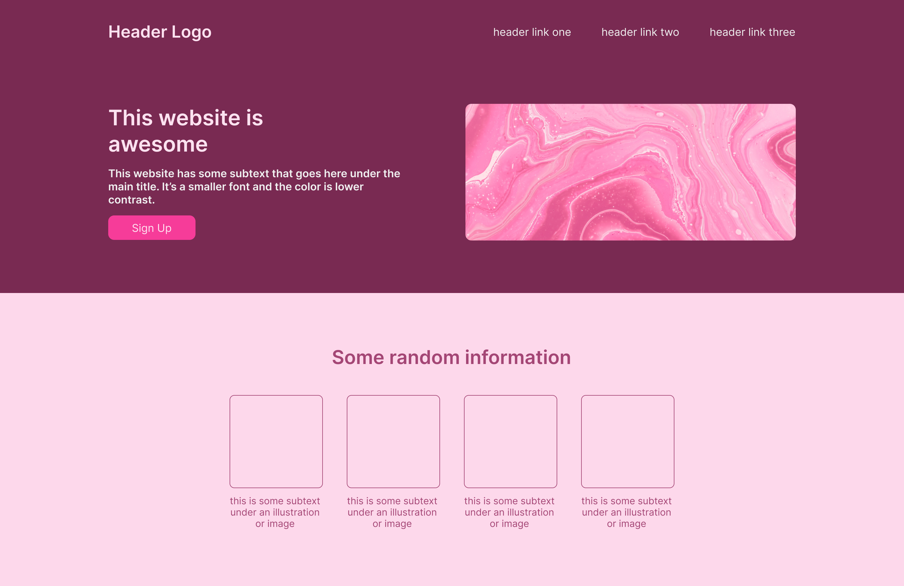
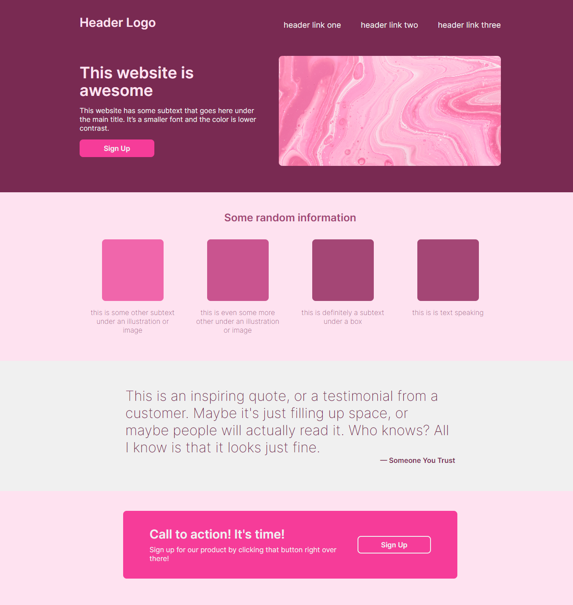

# Landing Page

Plain styled site. Practicing my CSS skills. Yet to implement media query responsiveness. 

## _[View the site](https://piotrnajda3000.github.io/landing-page/)_

**Project brief:** implement a website from a given design

I've reimplemented part of the design in Figma first, as a starting point:

The final outcome:

---

**Acknowledgements:** Hero image by [Paweł Czerwiński](https://unsplash.com/@pawel_czerwinski)
